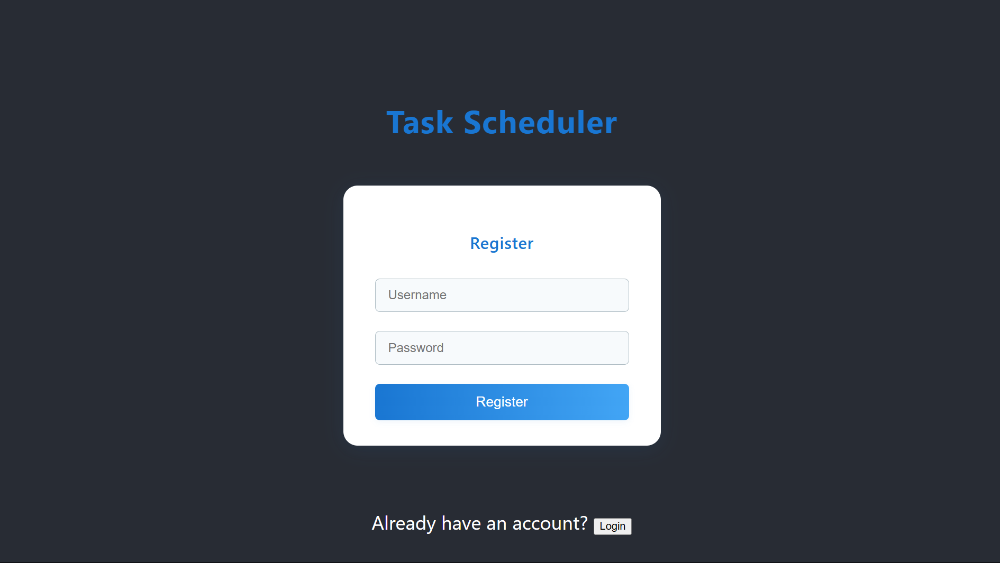
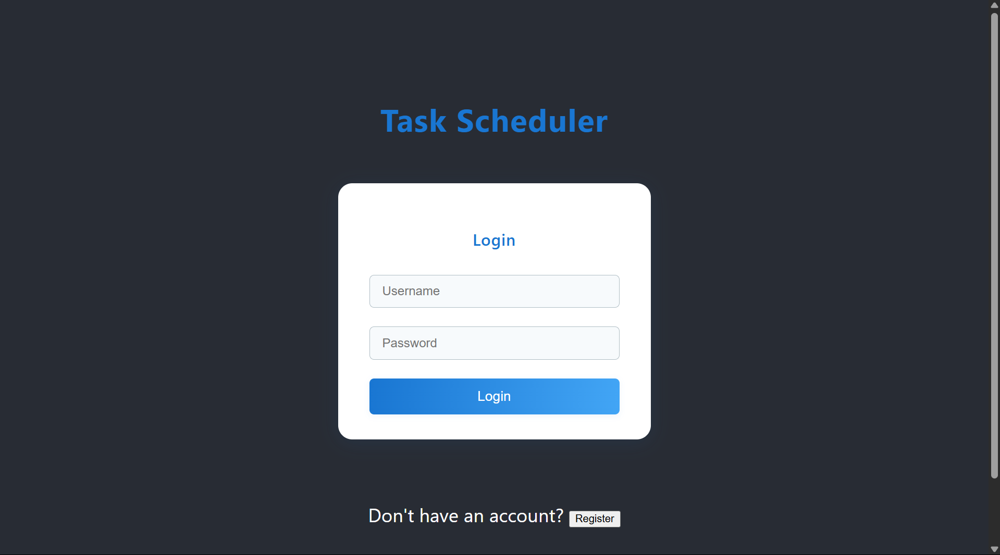
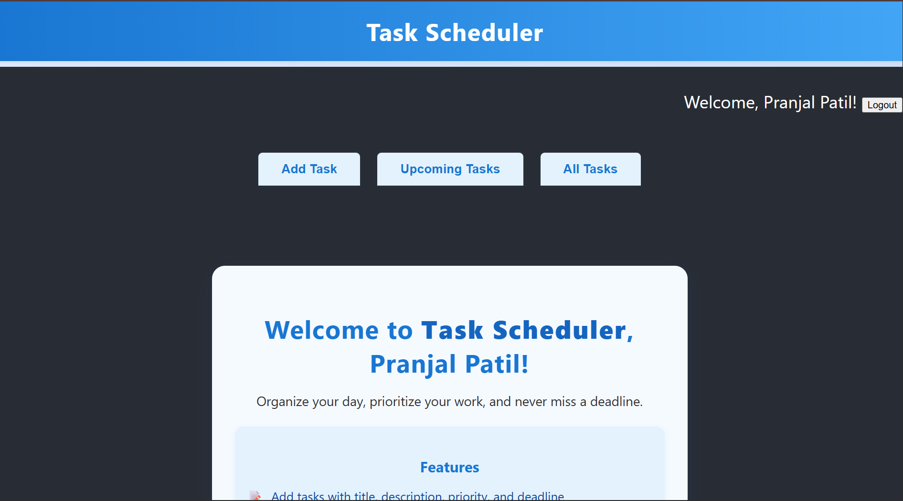
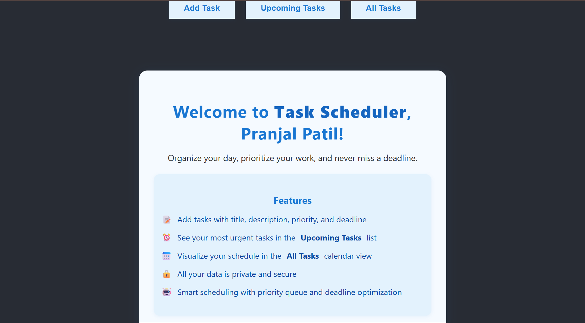
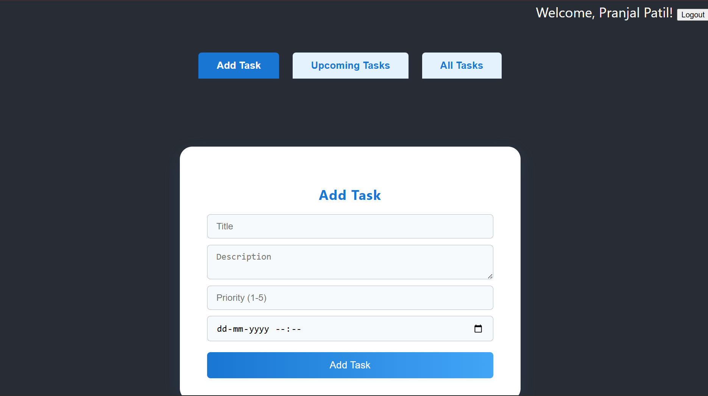
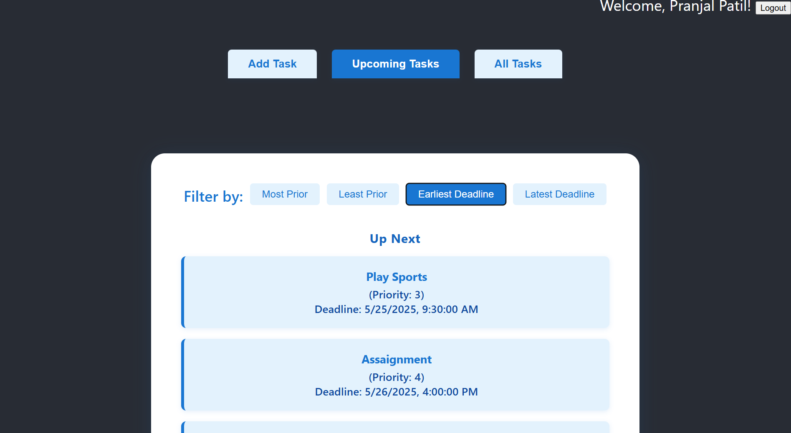
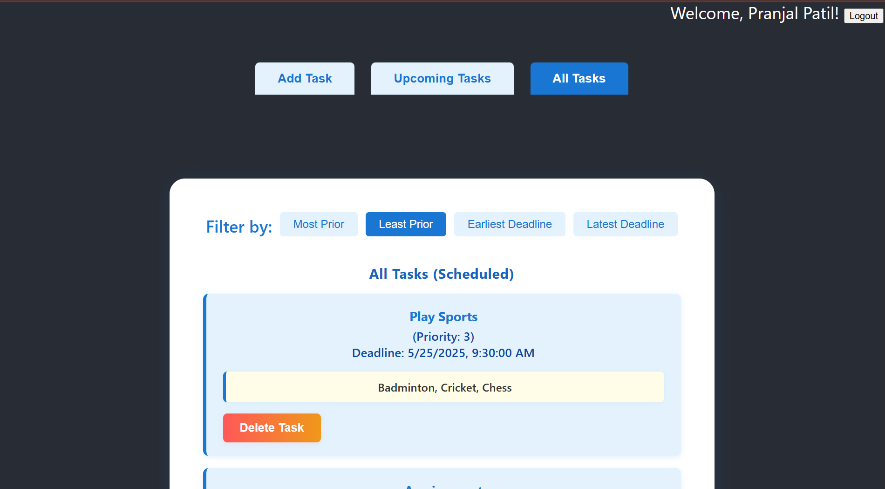

# Task Scheduler App

A full-featured MERN stack application for smart task scheduling, prioritization, and productivity.

## Project Architecture

[React Frontend (client)] ⟶ (REST API) ⟶ [Express Backend (api)] ⟶ (Mongoose ODM) ⟶ [MongoDB Database]

[Express Backend (api)] ⟶ (Authentication) ⟶ [JWT & Cookies]

## Features

- **User Authentication**
  - Secure registration and login with hashed passwords
  - Session management with JWT and cookies

- **Task Management**
  - Add tasks with title, description, priority, and deadline
  - View, expand, and delete tasks
  - Veiw tasks with filters: Most prior first, Least prior first, Latest deadline first, Latest deadline last

- **Smart Scheduling**
  - "Up Next" list: See your most urgent tasks for the upcoming week
  - "All Tasks" calendar view: Visualize all scheduled tasks
  - Backend uses a priority queue and greedy interval scheduling for optimal task order

- **Responsive UI**
  - Modern, clean, and responsive design for desktop and mobile
  - Filter and sort tasks by priority or deadline
  - Expand tasks to view details and delete

- **Security**
  - All user data is private and secure
  - Backend validation for all task and user operations

- **Other Features**
  - Logout functionality
  - Error handling and user feedback
  - Easy navigation between Add Task, Upcoming Tasks, and All Tasks

## Screenshots

### Register Page



### Login Page


### Home Page



### Add Task


### Upcoming Tasks(Less than 1 week deadline)


### All Tasks



## Getting Started

### Prerequisites

- Node.js and npm
- MongoDB (local or cloud)

### Setup Instructions

**Clone the repository**

   ```sh
   git clone https://github.com/pranjalpatil-23/Task-Scheduler.git
   cd Task-Scheduler
   cd Task Scheduler App
   ```

### Backend Setup

1. `cd api`
2. Install dependencies: `npm install`

3.Create a `.env` file with the following content (edit values as needed):

```env
MONGO_URI=mongodb://localhost:27017/taskSchedulerDB
PORT=5050
JWT_SECRET=your_jwt_secret_key
```
4. Start server: `npm start`
   - Default: [http://localhost:5050](http://localhost:5050)

### Frontend Setup

1. `cd client`
2. Install dependencies: `npm install`
3. Start React app: `npm start`
   - Default: [http://localhost:3000](http://localhost:3000)

## Folder Structure

```
Task Scheduler App/
├── api/
│   ├── models/
│   │   ├── Task.js
│   │   └── User.js
│   ├── index.js
│   └── .env
├── client/
│   ├── src/
│   │   ├── App.js
│   │   ├── App.css
│   │   ├── index.js
│   │   ├── index.css
│   │   ├── TaskForm.js
│   │   ├── UpNextList.js
│   │   ├── CalendarView.js
│   │   ├── HomePage.js
│   │   ├── HomePage.css
│   │   ├── LoginPage.js
│   │   ├── RegisterPage.js
│   │   ├── UserContext.js
│   │   └── ...
│   ├── public/
│   │   ├── index.html
│   │   ├── favicon.ico
│   │   ├── manifest.json
│   │   └── robots.txt
│   └── package.json
├── README.md
└── ...
```

## API Endpoints

| Method | Endpoint           | Description                        |
|--------|--------------------|------------------------------------|
| POST   | `/register`        | Register a new user                |
| POST   | `/login`           | Login user                         |
| POST   | `/logout`          | Logout and clear session           |
| GET    | `/profile`         | Get current user profile           |
| POST   | `/tasks`           | Add a new task                     |
| GET    | `/tasks`           | Get all tasks for the user         |
| GET    | `/schedule`        | Get optimized schedule             |
| DELETE | `/tasks/:id`       | Delete a task                      |

## Technologies Used

- **Frontend:** React.js, CSS
- **Backend:** Node.js, Express.js
- **Database:** MongoDB, Mongoose
- **Authentication:** JWT, bcryptjs, cookies
- **Other:** dotenv, cors

**Enjoy organizing your day with Task Scheduler App!**
